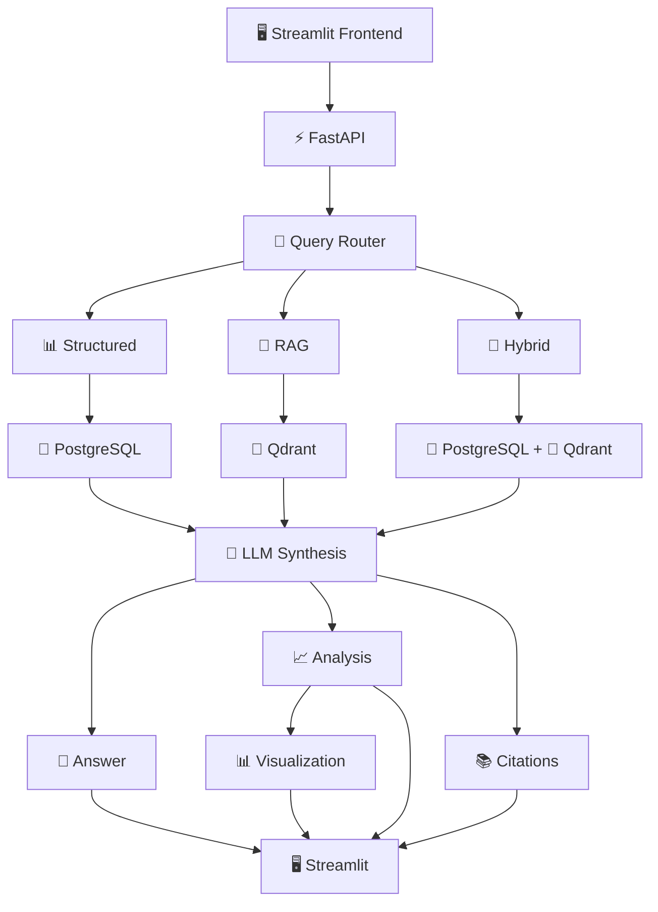
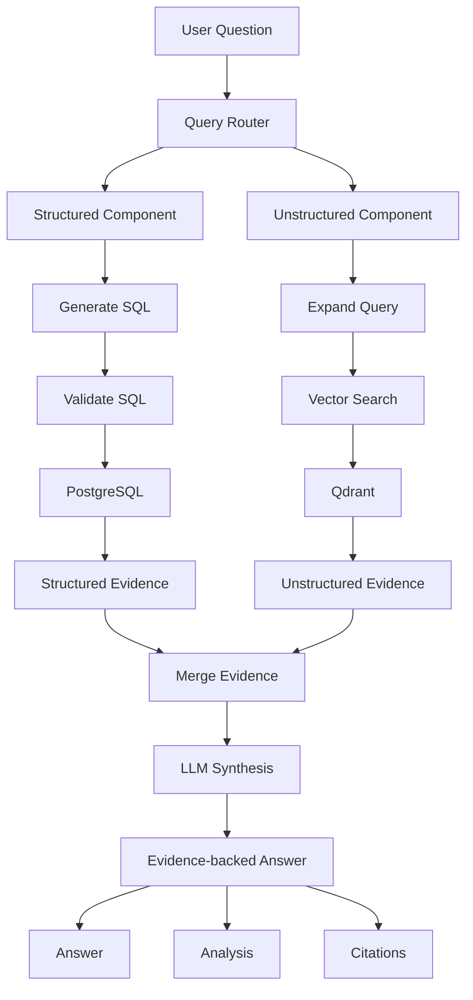
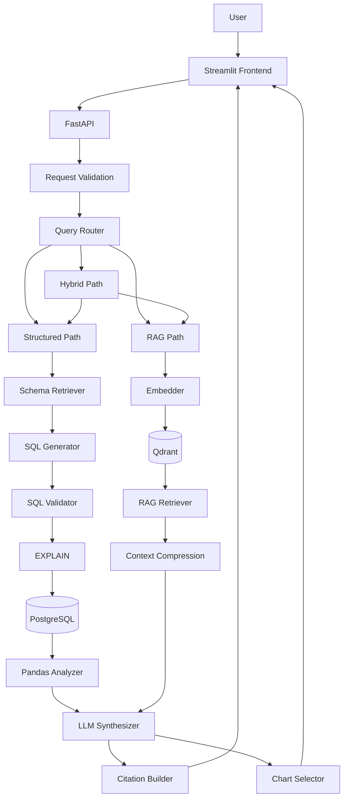

# DataPilot

> **AI Data Analyst — ask questions about structured data and documents using natural language.**

DataPilot is a production-oriented AI data analysis platform that turns natural-language questions into reliable, explainable data workflows.

Instead of manually writing SQL, inspecting spreadsheets, or searching through documents, a user can simply ask:

> **“Which company generated the highest revenue?”**

DataPilot determines the appropriate reasoning path, retrieves the relevant schema or document context, generates and validates SQL when required, executes read-only queries against PostgreSQL, analyzes the result with Pandas, retrieves supporting document evidence from Qdrant, selects an appropriate visualization, and produces a concise natural-language response.

---

## ✨ Why DataPilot?

Traditional BI workflows often require users to understand:

- SQL
- database schemas
- spreadsheet formulas
- statistical analysis
- chart selection
- document search

DataPilot hides that complexity behind a natural-language interface while keeping the underlying work **observable, testable, and explainable**.

### Core idea

## 🏗️ DataPilot Architecture



# 🚀 Key Capabilities

### Structured Data Analysis

- Upload **CSV, XLSX, and XLS** datasets
- Automatically register dataset metadata
- Profile columns and data types
- Create queryable PostgreSQL tables
- Retrieve relevant schema context for SQL generation
- Generate SQL from natural-language questions
- Validate SQL before execution
- Execute read-only queries safely
- Normalize database numeric/date values for API responses
- Analyze query results deterministically with Pandas
- Automatically select useful visualizations

### Document Intelligence / RAG

- Ingest PDF documents
- Extract page-level text
- Chunk document content
- Generate embeddings
- Store vectors in Qdrant
- Perform semantic retrieval
- Apply similarity thresholds
- Deduplicate retrieved chunks
- Reduce redundant context before LLM synthesis
- Return source citations with document/page information

### Hybrid Reasoning

Questions that require both structured facts and document context can use the hybrid pipeline:

### 🔀 Hybrid Query Flow



### Production-Oriented Reliability

- Read-only SQL enforcement
- Multiple-statement rejection
- SQL validation before execution
- Query result validation
- Empty-result handling
- Structured error responses
- Confidence handling
- Retrieval thresholds
- Retrieval deduplication
- Deterministic result analysis
- Automated regression tests
- Health checks
- Request/query observability

---

# 🧠 Query Execution Architecture

DataPilot separates **routing, execution, analysis, retrieval, and presentation** instead of putting all logic into one large LLM call.

## Structured Path

```text
POST /api/v1/query
        ↓
Request Validation
        ↓
Intent Router
        ↓
Schema Retrieval
        ↓
SQL Generation
        ↓
SQL Validation
        ↓
EXPLAIN / Query Safety Check
        ↓
PostgreSQL Execution
        ↓
Result Validation
        ↓
Optional Correction / Retry
        ↓
Pandas Analysis
        ↓
Chart Selection
        ↓
LLM Synthesis
        ↓
Stable API Response
```

## RAG Path

```text
Question
   ↓
Embedding
   ↓
Qdrant Vector Search
   ↓
Similarity Threshold
   ↓
Metadata Filtering
   ↓
Deduplication
   ↓
Top-K Selection
   ↓
Context Compression
   ↓
LLM Synthesis
   ↓
Answer + Citations
```

## Hybrid Path

```text
                    Question
                       ↓
                     Router
                       ↓
              ┌────────┴────────┐
              ↓                 ↓
          Structured           RAG
              ↓                 ↓
          PostgreSQL          Qdrant
              ↓                 ↓
              └────────┬────────┘
                       ↓
                 LLM Synthesis
                       ↓
          Answer + Analysis + Citations
                       ↓
                  Visualization
```

---

# 🏗️ System Architecture



---

# 🔄 End-to-End Request Lifecycle

Every query follows a controlled lifecycle.

### 1. Request validation

The API validates the incoming request before any database or LLM operation.

### 2. Intent routing

The router determines whether the question is:

- **Structured** — answerable from tabular data
- **RAG** — answerable from documents
- **Hybrid** — requires both

### 3. Context retrieval

Structured queries retrieve relevant database schema information.

Document queries retrieve semantically relevant document chunks.

### 4. Generation

The appropriate LLM component produces the SQL or natural-language synthesis required by the selected path.

### 5. Validation

Generated SQL is checked before execution.

DataPilot rejects dangerous operations such as:

```sql
DROP
DELETE
UPDATE
INSERT
ALTER
TRUNCATE
```

and rejects multiple SQL statements.

### 6. Execution

Validated read-only SQL is executed against PostgreSQL.

### 7. Result verification

The result is checked for:

- valid columns
- valid rows
- empty results
- supported data types
- JSON-safe values

### 8. Analysis

Pandas performs deterministic analysis including:

- row/column counts
- numeric summaries
- categorical summaries
- minimum/maximum values
- result previews

### 9. Visualization

The chart selector determines whether the result is better represented as:

- metric
- bar chart
- line chart
- table

### 10. Synthesis

The LLM converts the validated evidence into a concise user-facing answer.

### 11. Response

The API returns a stable response containing the answer and supporting metadata.

---

# 📦 Stable API Response

A successful query follows a predictable response contract:

```json
{
  "success": true,
  "mode": "structured",
  "question": "Which product generated the highest revenue?",
  "answer": "MacBook generated the highest revenue with total_revenue = 6500.0.",
  "key_points": [
    "The query result returns one row.",
    "MacBook has the highest total revenue.",
    "The maximum total_revenue is 6500.0."
  ],
  "confidence": 0.95,
  "sql": "SELECT ...",
  "sql_explanation": "Aggregates revenue per product and returns the highest total.",
  "result": {
    "columns": ["product_name", "total_revenue"],
    "rows": [
      {
        "product_name": "MacBook",
        "total_revenue": 6500.0
      }
    ],
    "row_count": 1
  },
  "analysis": {},
  "visualization": {},
  "citations": []
}
```

This contract makes the backend easy to consume from Streamlit today and from a future React/Next.js client or other application later.

---

# 🖥️ Frontend

DataPilot includes a Streamlit interface designed around a simple analyst workflow:

```text
┌──────────────────────────────────────────────┐
│                  DataPilot                   │
├──────────────────────────────────────────────┤
│ Upload CSV / Excel                           │
│                                              │
│ Ask anything about your data or documents    │
│ ┌──────────────────────────────────────────┐ │
│ │ Which product generated the highest      │ │
│ │ revenue?                                 │ │
│ └──────────────────────────────────────────┘ │
│                                              │
│              [ Ask DataPilot ]               │
│                                              │
│ Answer                                       │
│ ──────────────────────────────────────────── │
│ MacBook generated the highest revenue...     │
│                                              │
│             Revenue by Product               │
│                 ███████                      │
│                 ███████                      │
│                                              │
│ Result Data ▼                                │
│ SQL ▼                                        │
│ Analysis ▼                                   │
│ Citations ▼                                  │
└──────────────────────────────────────────────┘
```

The UI exposes the important evidence without forcing the user to understand the implementation.


---

# 🛠️ Technology Stack

| Layer | Technology |
|---|---|
| Language | Python 3.14 |
| API | FastAPI |
| Frontend | Streamlit |
| LLM | OpenAI API |
| Structured Storage | PostgreSQL |
| Vector Database | Qdrant |
| Vector Extension | pgvector |
| ORM / SQL Execution | SQLAlchemy |
| Data Analysis | Pandas |
| Data Files | CSV / Excel |
| PDF Processing | PyMuPDF / pypdf |
| Visualization | Plotly |
| Validation | Pydantic |
| Testing | Pytest |
| Containerization | Docker / Docker Compose |
| Configuration | `.env` / Pydantic Settings |

---

# 📁 Project Structure

```text
DataPilot/
│
├── backend/
│   ├── agents/
│   │
│   ├── analysis/
│   │   ├── analyzer.py
│   │   └── synthesizer.py
│   │
│   ├── api/
│   │   └── routes.py
│   │
│   ├── core/
│   │   ├── config.py
│   │   └── logging.py
│   │
│   ├── database/
│   │   ├── connection.py
│   │   ├── models.py
│   │   └── schema/
│   │       ├── 00_extensions.sql
│   │       ├── 01_schemas.sql
│   │       ├── 02_auth.sql
│   │       ├── 03_auth_sessions.sql
│   │       ├── 04_common_functions.sql
│   │       ├── 05_knowledge.sql
│   │       └── 06_structured.sql
│   │
│   ├── ingestion/
│   │   ├── csv_loader.py
│   │   ├── excel_loader.py
│   │   ├── pdf_loader.py
│   │   └── profiler.py
│   │
│   ├── orchestration/
│   │   └── query_orchestrator.py
│   │
│   ├── rag/
│   │   ├── chunker.py
│   │   ├── embedder.py
│   │   ├── retriever.py
│   │   └── vector_store.py
│   │
│   ├── services/
│   │   ├── file_service.py
│   │   ├── ingestion_service.py
│   │   ├── metadata_service.py
│   │   ├── query_service.py
│   │   ├── rag_ingestion_service.py
│   │   └── schema_service.py
│   │
│   ├── sql/
│   │   ├── executor.py
│   │   ├── generator.py
│   │   ├── schema_formatter.py
│   │   ├── schema_retriever.py
│   │   └── validator.py
│   │
│   ├── visualization/
│   │   └── chart_selector.py
│   │
│   └── main.py
│
├── frontend/
│   └── streamlit_app.py
│
├── tests/
│   ├── test_analyzer.py
│   ├── test_chart_selector.py
│   ├── test_chunker.py
│   ├── test_database.py
│   ├── test_health.py
│   ├── test_ingestion_service.py
│   ├── test_metadata_service.py
│   ├── test_profiler.py
│   ├── test_query_router.py
│   ├── test_rag_quality.py
│   ├── test_rag_retriever.py
│   ├── test_schema_retriever.py
│   ├── test_schema_service.py
│   ├── test_sql_executor.py
│   ├── test_sql_generator.py
│   ├── test_sql_pipeline.py
│   ├── test_sql_validator.py
│   └── test_synthesizer.py
│
├── data/
├── docker/
├── docker-compose.yml
├── requirements.txt
├── .env.example
├── .gitignore
├── LICENSE
└── README.md
```

---

# 🔐 Safety & Reliability

DataPilot is intentionally designed so that the LLM does **not** have unrestricted database access.

## SQL Safety

The SQL pipeline separates generation from execution:

```text
LLM
 ↓
Generated SQL
 ↓
Validator
 ↓
EXPLAIN / Safety Check
 ↓
Read-only Execution
 ↓
Result
```

The validator rejects non-read-only operations and malformed/multiple statements before they reach the database.

## Deterministic Analysis

The LLM is not responsible for calculating every statistic.

Pandas performs deterministic calculations for:

- sums
- averages
- medians
- minimums
- maximums
- counts
- categorical frequencies

This reduces unnecessary LLM dependence and makes analytical output easier to test.

## RAG Guardrails

Retrieval is controlled through:

```text
Similarity
   ↓
Threshold
   ↓
Metadata filtering
   ↓
Deduplication
   ↓
Top-K
   ↓
Context compression
```

This prevents irrelevant or highly repetitive document context from unnecessarily reaching the synthesis model.

---

# 📊 Example Questions

### Structured

```text
Which company generated the highest revenue overall?
```

```text
What are the top 5 companies by net income?
```

```text
Which company had the highest ROE in 2022?
```

```text
Show total revenue by company.
```

```text
Compare Apple and Microsoft revenue in 2022.
```

### Document / RAG

```text
What are the main findings discussed in the report?
```

```text
Summarize the recommendations in the report.
```

```text
What does the report say about the proposed architecture?
```

### Hybrid

```text
Which company had the highest revenue, and what does the report
recommend about improving financial performance?
```

The router can combine structured database evidence with document evidence when both are required.

---

# ⚡ Quick Start

## 1. Clone the repository

```bash
git clone <your-repository-url>
cd DataPilot
```

## 2. Create the virtual environment

```bash
python3 -m venv venv
source venv/bin/activate
```

## 3. Install dependencies

```bash
pip install -r requirements.txt
```

## 4. Configure environment variables

```bash
cp .env.example .env
```

Set the required values in `.env`, including the OpenAI API key and database/vector-store configuration used by the application.

> **Never commit `.env` or API keys to Git.**

## 5. Start infrastructure

```bash
docker compose up -d
```

Verify the containers:

```bash
docker compose ps
```

The development stack uses:

- PostgreSQL on `localhost:5433`
- Qdrant on `localhost:6333`

## 6. Start the FastAPI backend

```bash
uvicorn backend.main:app --reload --host 127.0.0.1 --port 8000
```

API:

```text
http://127.0.0.1:8000
```

Swagger:

```text
http://127.0.0.1:8000/docs
```

## 7. Start Streamlit

In another terminal:

```bash
source venv/bin/activate
streamlit run frontend/streamlit_app.py
```

Frontend:

```text
http://localhost:8501
```

---

# 🔌 API Usage

## Health Check

```bash
curl http://127.0.0.1:8000/health
```

## Ask a Question

```bash
curl -X POST http://127.0.0.1:8000/api/v1/query \
  -H "Content-Type: application/json" \
  -d '{"question":"Which product generated the highest revenue?"}'
```

A successful response contains the execution mode, answer, confidence, SQL where applicable, result data, analysis, visualization metadata, and citations.

---

# 🧪 Testing

The project uses Pytest for unit, integration, regression, and pipeline-level validation.

Run the complete suite:

```bash
pytest -v
```

Run a specific area:

```bash
pytest tests/test_rag_quality.py -v
```

```bash
pytest tests/test_sql_pipeline.py -v
```

```bash
pytest tests/test_query_router.py -v
```

The test suite covers important behaviors including:

- database connectivity
- ingestion
- profiling
- schema retrieval
- SQL generation
- SQL validation
- SQL execution
- decimal/numeric normalization
- empty results
- structured/RAG/hybrid routing
- RAG retrieval
- retrieval quality
- chunking
- analysis
- visualization selection
- LLM synthesis
- confidence validation

---

# 🧩 Engineering Principles

DataPilot follows several principles designed to keep an AI-heavy application maintainable.

### 1. Deterministic code before probabilistic code

Use normal Python/database logic wherever possible.

Use the LLM for tasks where language reasoning provides real value:

- intent understanding
- SQL generation
- synthesis
- contextual explanation

### 2. Validate before executing

Never trust generated SQL simply because it came from an LLM.

### 3. Evidence before explanation

The final answer should be grounded in:

- database results
- deterministic analysis
- retrieved document context

### 4. Small, testable components

Routing, retrieval, validation, execution, analysis, visualization, and synthesis remain separate components.

### 5. Stable interfaces

The API response is designed as a stable contract so the frontend does not need to understand internal implementation details.

### 6. Observable failures

Failures should become useful API errors rather than opaque stack traces.

---

# 🗺️ Development Roadmap

## Phase 1 — Backend Hardening

Completed core hardening around:

- numeric/date normalization
- chart selection
- structured/RAG/hybrid regression tests
- empty-result handling
- retrieval thresholds
- API error handling
- logging and observability

## Phase 2 — Production Query Quality

Implemented the production-oriented SQL pipeline:

```text
Question
   ↓
Router
   ↓
SQL Generation
   ↓
SQL Validation
   ↓
EXPLAIN
   ↓
Execute
   ↓
Result Check
   ↓
Optional Correction / Retry
   ↓
Analysis
```

## Phase 3 — RAG Quality

Implemented/improved:

```text
Query
 ↓
Embedding
 ↓
Vector Search
 ↓
Similarity Threshold
 ↓
Deduplication
 ↓
Top-K
 ↓
Context Compression
 ↓
LLM
```

The goal is to prevent redundant chunks from the same document/page from dominating the context.

## Phase 4 — API & Frontend

The application exposes a stable response contract and provides a Streamlit analyst interface with:

- file upload
- natural-language queries
- answers
- confidence
- visualizations
- result data
- SQL inspection
- analysis details
- citations

## Phase 5 — Final Engineering

Finalization focuses on:

- Dockerized application services
- infrastructure health checks
- `.env.example`
- CI/CD
- complete documentation
- final architecture documentation
- demo datasets
- end-to-end testing
- release-ready repository

---

# 🐳 Docker Architecture

The infrastructure is containerized using Docker Compose.

```text
                 Docker Compose
                       │
          ┌────────────┴────────────┐
          │                         │
          ▼                         ▼
   PostgreSQL + pgvector          Qdrant
       :5433                      :6333
          │                         │
          └────────────┬────────────┘
                       │
                 DataPilot Backend
                       │
                 Streamlit Frontend
```

The Docker setup provides persistent volumes for PostgreSQL and Qdrant so development data survives container restarts.

---

# 📈 What Makes DataPilot Different?

DataPilot is not simply a chatbot placed on top of a database.

It combines several specialized systems:

```text
          Natural Language
                 │
                 ▼
          Intent Routing
                 │
       ┌─────────┴─────────┐
       │                   │
       ▼                   ▼
 Text-to-SQL              RAG
       │                   │
       ▼                   ▼
 PostgreSQL              Qdrant
       │                   │
       └─────────┬─────────┘
                 ▼
          Deterministic
             Analysis
                 │
                 ▼
          LLM Synthesis
                 │
       ┌─────────┼─────────┐
       ▼         ▼         ▼
    Answer    Chart    Citations
```

The architecture deliberately combines **LLM reasoning with deterministic software components**.

That distinction is important for building a system that is not only impressive in a demo, but also easier to test, debug, and extend.

---

# 🔮 Future Extensions

Potential future capabilities include:

- conversational follow-up questions
- multi-dataset joins
- richer statistical analysis
- anomaly detection
- forecasting
- advanced dashboard generation
- multimodal document understanding
- image/table extraction from PDFs
- user authentication and permissions
- query history
- saved analyses
- streaming responses
- asynchronous ingestion jobs
- distributed workers
- production observability
- model routing and cost optimization

---

# 📜 License

This project is distributed under the license included in [`LICENSE`](LICENSE).

---

# 👨‍💻 Project Philosophy

> **Ask a question. DataPilot does the analysis.**

The long-term vision is to make sophisticated data analysis feel as natural as having a conversation with an expert analyst, while retaining the engineering discipline required for reliable software.

**DataPilot — from question to insight.**
